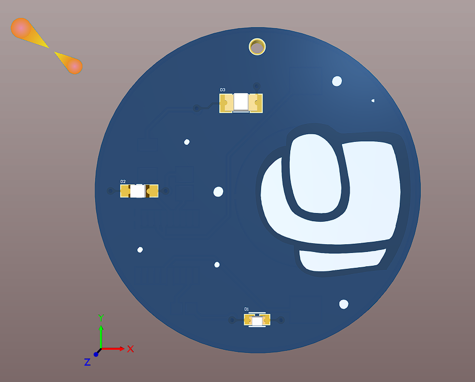
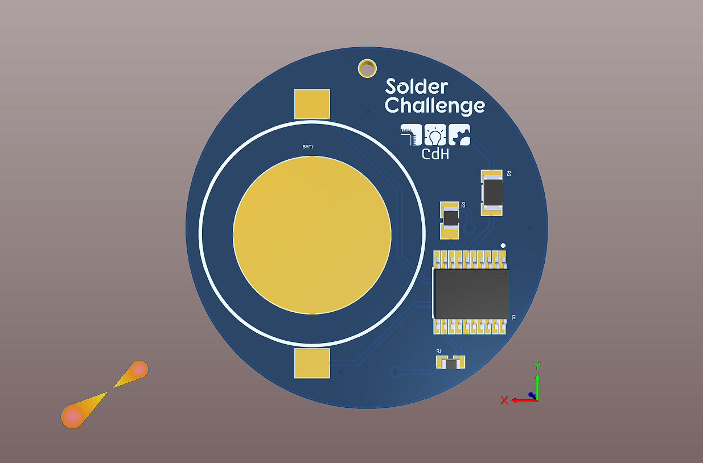
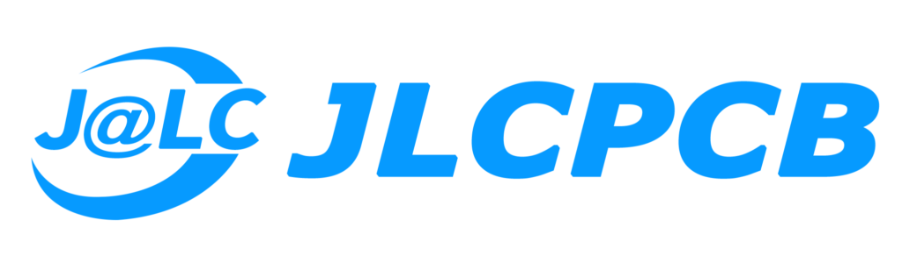

# Soldering Challenge PCB - Among Us Version

This is my first pcb and it'll be used in a soldering training course by [Clube do Hardware](https://github.com/CdHUFC). After the training, the pcb will work as a key chain.

# 3D Top View

# 3D Bottom View

This PCB will be sponsored by [JLCPB](https://jlcpcb.com/)

